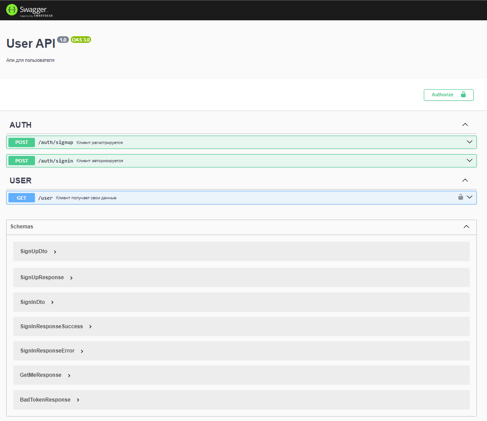

* всё тестируется через сваггер
* по хорошему надо было сделать 4 сервиса. 2 сервиса http api, 2 сервиса nats api, но было сделано по стеку тз

___TODO swagger:___ http://localhost:3001/870c66c1-64e0-418f-9d78-57c38739dd23/documentation
___USER swagger:___ http://localhost:3000/870c66c1-64e0-418f-9d78-57c38739dd23/documentation

Для запуска потребуется:

* ``./todo-api/env.example ./todo-api/.env``
* ``./user-api/env.example ./user-api/.env``
* ``docker-compose build``
* ``docker-compose up -d``

User сервис:

``POST: http://localhost:3000/auth/signup``:

``POST: http://localhost:3000/auth/signin``:

``GET: http://localhost:3000/user``:

Todo сервис:

``POST: http://localhost:3001/task``:

``GET: http://localhost:3001/task``:

``DELETE: http://localhost:3001/task``:

